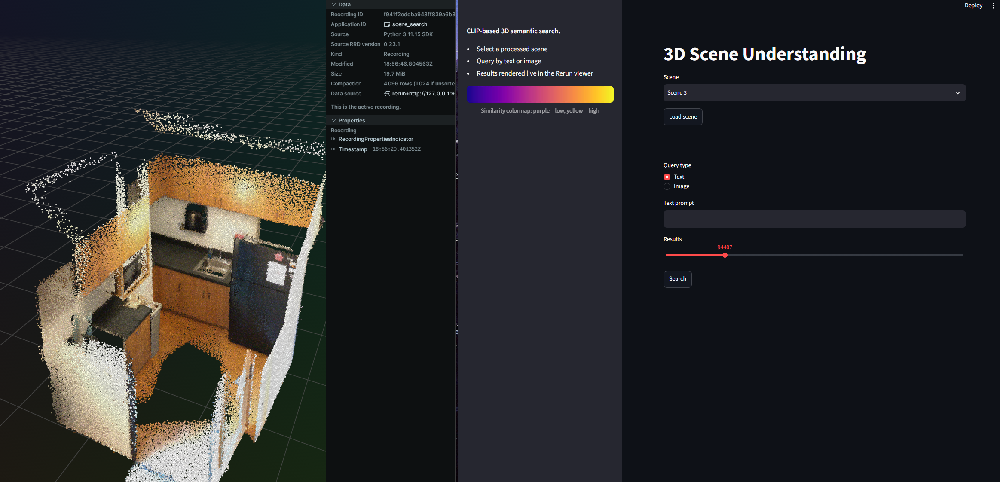
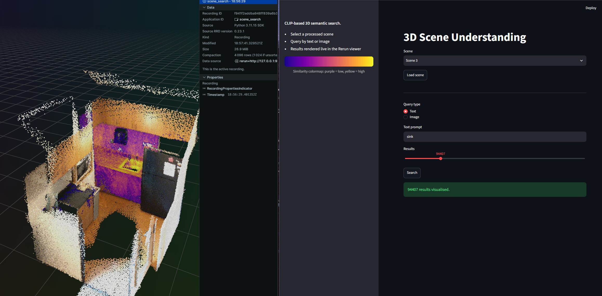

# Open 3D Scene Understanding





Open-vocabulary semantic search over 3D scenes: segment each frame with SAM2,
embed every mask with CLIP, back-project to world space, then query the
resulting point cloud by text or image.

---

## How it works

```
scene.sens  (ScanNet)
    │
    ▼
ScanNet/prepare_scene.py   ← unpack RGB + depth + pose per frame; save intrinsics.json
    │
    ▼
src/pipeline.py
    ├── Step 0  sam2_segment       SAM2 masks per frame → mask_*.png + object_*.pcd
    ├── Step 1  clip_embed         CLIP encode each mask crop; recursive disk-spill merge
    │                              → embedded_pointcloud.npz  (sparse, CLIP-embedded)
    ├── Step 2  dense_pointcloud   Full RGBD unproject of all frames
    │                              → dense_pointcloud.npz  (dense geometry + colours)
    ├── Step 3  interpolate        Gaussian-weighted KNN: spread CLIP embeddings
    │                              from sparse onto dense cloud (in-place update)
    └── Step 4  vectorstore        ChromaDB cosine index from dense_pointcloud.npz
    │
    ▼
app.py  (Streamlit + Rerun)   text / image query → highlighted 3D regions
```

---

## Data format

The pipeline reads a directory of **per-frame sub-folders**:

```
ScanNet/RGBD/scene0001_00/
├── intrinsics.json          ← per-scene camera intrinsics (written by prepare_scene.py)
├── 000000/
│   ├── rgb_image.png        480 × 640 RGB
│   ├── depth_image.png      16-bit PNG, unit = mm
│   └── pose.npy             4 × 4 float32 camera-to-world matrix
├── 000001/
│   └── …
└── …
```

After SAM2 runs (Step 0), each frame folder also gains:

```
├── 000000/
│   ├── mask_0.png           binary 2D mask  (uint8, 0 / 255)
│   ├── object_0.pcd         world-space point cloud for that mask
│   ├── mask_1.png
│   ├── object_1.pcd
│   └── …
```

**`intrinsics.json`** schema:

```json
{
  "fx": 577.87, "fy": 577.87,
  "cx": 319.5,  "cy": 239.5,
  "width": 640, "height": 480
}
```

If the file is absent, the pipeline falls back to the defaults in
`src/config.yaml → default_intrinsics`.

---

## Setup

**Requirements**: CUDA-capable GPU, [uv](https://docs.astral.sh/uv/) package manager.

Tested on: RTX 5070 Ti (sm_120), driver 610, CUDA 13.3.

```bash
./setup.sh
```

This installs Python 3.11, PyTorch cu128, SAM2, OpenAI CLIP, Open3D, ChromaDB,
Streamlit, and Rerun, and downloads the SAM2 checkpoint to `checkpoints/`.

---
### 1. Download a scene

ScanNet requires a signed licence — see the [ScanNet GitHub page](https://github.com/ScanNet/ScanNet).

```bash
python ScanNet/download.py -o ScanNet/scans --id scene0001_00
```

### 2. Extract frames + run the full pipeline in one command

```bash
python ScanNet/prepare_scene.py \
    --sens     ScanNet/scans/scene0001_00/scene0001_00.sens \
    --out_dir  ScanNet/RGBD/scene0001_00 \
    --frame_skip 10 \
    --run_pipeline \
    --scene_name "Living Room"
```

`--frame_skip 10` keeps 1 in 10 frames (SAM2 runs on 1-in-`frame_stride`
frames from config; `frame_skip` controls which frames are extracted).

### 3 Run full pipeline
uv run python -m src.pipeline \
    --run_path   ScanNet/RGBD/scene0001_00 \
    --scene_name "Living Room"
### 4. Launch the app

```bash
uv run streamlit run app.py
```

1. Select a scene from the dropdown.
2. Click **Load scene** — loads the CLIP model, ChromaDB index, and point cloud
   into the Rerun viewer.
3. Choose **Text** or **Image** query and click **Search**.
4. Matching points are highlighted with a plasma colour map (purple = low
   similarity, yellow = high).

---

## Visualisation

Inspect any `.npz` file directly (no Streamlit required):

```bash
# Normal RGB colours
uv run python tools/visualize.py --npz_file path/to/dense_pointcloud.npz

# PCA of CLIP embeddings → pseudo-colour
uv run python tools/visualize.py --npz_file path/to/dense_pointcloud.npz --mode pca
```

---

## Configuration

`src/config.yaml`:

| Key | Default | Description |
|---|---|---|
| `frame_stride` | 10 | Every Nth frame is processed by SAM2 / CLIP |
| `point_stride` | 10 | Pixel sub-sampling in depth unprojection |
| `min_depth` / `max_depth` | 0.5 / 6.0 | Valid depth range (metres) |
| `weights` | `ViT-B/32` | CLIP model variant |
| `interpolation_k` | 21 | KNN neighbours for embedding interpolation |
| `downsample_rate` | 3 | PCD uniform down-sample before CLIP embedding |
| `logic` | `patch` | Mask crop mode: `patch` (bounding box), `bin` (binary), `dilated` |
| `sam2.points_per_side` | 32 | SAM2 grid density |
| `sam2.pred_iou_thresh` | 0.80 | SAM2 mask quality threshold |
| `sam2.stability_score_thresh` | 0.80 | SAM2 stability threshold |
| `sam2.min_mask_region_area` | 200 | Minimum mask area in pixels |
| `sam2.merge_radius` | 0.01 | Voxel size for per-frame cloud merging (metres) |
| `default_intrinsics.*` | ScanNet avg | Fallback intrinsics if `intrinsics.json` is absent |

---

## Project layout

```
open-3d-scene-understanding/
├── app.py                       Streamlit search UI + Rerun visualisation
├── scenes_config.yaml           Registry of processed scenes (written by pipeline)
├── pyproject.toml               uv dependencies
├── setup.sh                     One-shot install
├── plasma_colormap.png          Legend shown in the sidebar
│
├── checkpoints/
│   └── sam2.1_hiera_base_plus.pt
│
├── ScanNet/
│   ├── prepare_scene.py         Single .sens → frame folders + optional pipeline run
│   ├── unpack_images.py         Batch .sens extraction across many scenes
│   ├── download.py              Official ScanNet downloader
│   └── scannet_sensordata.py    Python 3 .sens reader (from ScanNet repo)
│
├── tools/
│   ├── visualize.py             Point cloud viewer (Rerun), normal / pca modes
│   ├── extract_video.py         Extract frames from a video file
│   └── triangulate.py           Triangulation utility
│
└── src/
    ├── config.yaml              Pipeline parameters
    ├── pipeline.py              Five-step orchestrator
    └── scene_search/
        ├── _config.py           Config loader
        ├── utils.py             Shared helpers (load_pose, load_intrinsics, …)
        ├── sam2_segment.py      Step 0 – SAM2 masks → 3D point clouds per object
        ├── clip_embed.py        Step 1 – CLIP encode + recursive disk-spill merge
        ├── dense_pointcloud.py  Step 2 – Full RGBD depth fusion
        ├── interpolate.py       Step 3 – Gaussian KNN embedding interpolation
        └── vectorstore.py       Step 4 – ChromaDB cosine index
```

---

## Output files

After running the pipeline for `"Living Room"` over `scene0001_00`:

```
ScanNet/RGBD/scene0001_00/Living Room/
├── embedded_pointcloud.npz   sparse cloud: points, colors, embeddings  (Step 1)
├── dense_pointcloud.npz      dense cloud:  points, colors, embeddings  (Steps 2–3)
└── vector_store/             ChromaDB persistent store                 (Step 4)
```

`scenes_config.yaml` is updated automatically:

```yaml
scenes:
  Living Room:
    npz_file:      /abs/path/dense_pointcloud.npz
    chromadb_path: /abs/path/vector_store
    collection:    Living_Room_points
```
